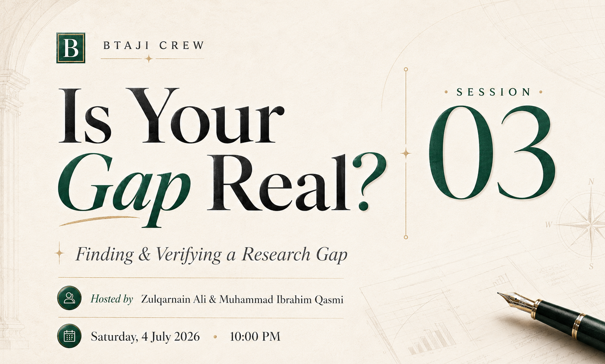

# Session 3 - Is Your Gap Real?

> A practical session on where research ideas come from, and how to prove a research gap is real before you spend months on it.

| | |
|---|---|
| **Date** | 3 July 2026 |
| **Duration** | ~1 hour 53 minutes |
| **Language** | Urdu |
| **Hosts** | Muhammad Ibrahim Qasmi (Youngest 3x Kaggle Grandmaster) and Zulqarnain Ali (Kaggle Competition Expert) |
| **Level** | Beginner |

## Watch the recording

[Watch on YouTube](https://youtu.be/lGJdD1jZDdo)

[Watch the full playlist](https://youtube.com/playlist?list=PLJPlXj5tLhiE&si=0679eGl6FdBYb1lH)

## Slides

[session-3-slides.pptx](session-3-slides.pptx)

## Prompts

The three deep-research prompts used live are in [prompts/](prompts/): the landscape sweep, the gap validation, and the merge prompt. See [prompts/README.md](prompts/README.md) for how to use them and the AI Literature Rule.

## What we covered

- Where research ideas come from: competitions and project boards that hand you a problem, a dataset, and a path to publish (Kaggle, Solafune, Grand Challenge and MICCAI, KAUST).
- The competition-as-paper move: take a recent competition, extend a public solution, and write it up.
- Narrowing a whole field down to one specific, testable problem.
- Finding papers by hand on Google Scholar: smart queries and the citation tree.
- Sweeping the whole recent field with AI deep-research tools, then merging every result into one master table.
- Verifying the papers are real, because these tools invent citations.
- The Grandma Test, and validating a gap (open, partially taken, or already done) before committing.

## Timeline

| Time | Topic |
|---:|---|
| 00:00 | Intro and recap of Sessions 1 and 2 |
| 03:00 | Part A: where research ideas come from |
| 13:03 | Kaggle and Solafune: the competition-as-paper move |
| 13:37 | Grand Challenge and MICCAI medical imaging challenges |
| 21:04 | KAUST project boards for research ideas |
| 40:00 | Part B: narrowing a field to one problem (ECG digitization) |
| 41:46 | Finding papers by hand on Google Scholar |
| 56:06 | The AI sweep: Claude, ChatGPT, Gemini, and Kimi map the field |
| 1:12:00 | Merging every tool's output into one master table |
| 1:14:50 | Verifying the papers are real |
| 1:18:25 | The Grandma Test and validating the gap |
| 1:28:18 | Your task |
| 1:41:26 | Research is a skill: closing and Q&A |

## Platforms and tools shown

- Kaggle - https://www.kaggle.com/
- Solafune - https://community.solafune.com/competitions
- Grand Challenge (MICCAI) - https://grand-challenge.org/challenges/
- KAUST project search - https://admissions.kaust.edu.sa/internship/search
- Papers With Code - https://paperswithcode.com/
- ECG digitization benchmark, PhysioNet Challenge 2024 - https://moody-challenge.physionet.org/2024/

## Worked example

The whole gap-finding workflow was shown live on one example: **ECG image digitization**, turning a photo or scan of a paper ECG back into a clean digital signal.

## Your task

1. Pick one field you care about.
2. Run the collection prompt (in [prompts/](prompts/)) on one free tool.
3. Verify by hand: open five links and delete any that do not resolve.
4. Write one candidate gap as a Context and Obstacle sentence.
5. Run the validation prompt on it, and bring your verdict (open, partial, or done) to the community.

## Join the community

[WhatsApp group](https://chat.whatsapp.com/E29f5rozhAo8RbKjA00eSh)
