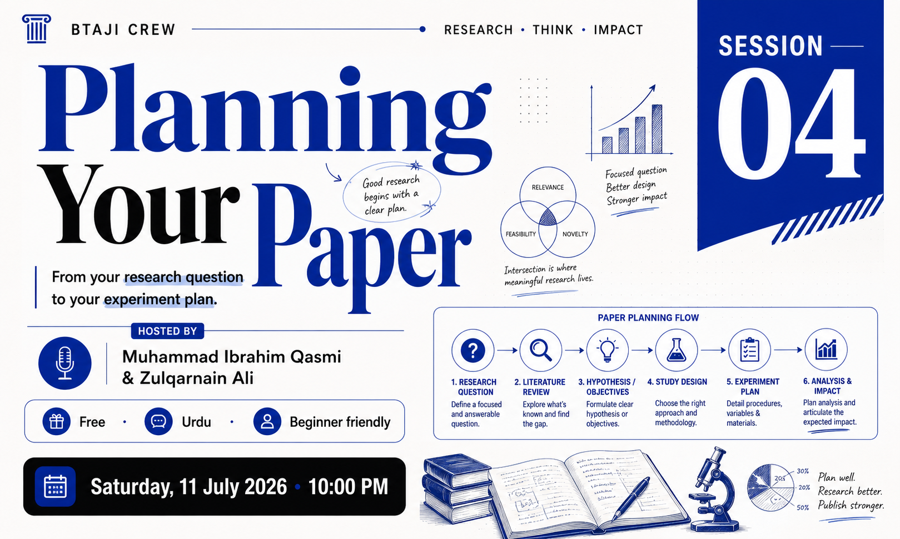

# Session 4 - Planning Your Paper

> A practical session on turning a validated research gap into a plan: the shape of a paper, and the experiment that fills it.

| | |
|---|---|
| **Date** | 11 July 2026 |
| **Duration** | ~1 hour 35 minutes |
| **Language** | Urdu |
| **Hosts** | Muhammad Ibrahim Qasmi (Youngest 3x Kaggle Grandmaster) and Zulqarnain Ali (Kaggle Competition Expert) |
| **Level** | Beginner |

## Watch the recording

[Watch on YouTube](https://youtu.be/ln9pncI2niw)

[Watch the full playlist](https://youtube.com/playlist?list=PLJPlXj5tLhiE&si=0679eGl6FdBYb1lH)

## Slides

[session-4-slides.pptx](session-4-slides.pptx)

## Paper and templates

In [paper/](paper/):

- **[research-paper-template.tex](paper/research-paper-template.tex)** ([PDF](paper/research-paper-template.pdf)) - a reusable, color-coded template you can copy for any topic. It explains, section by section, what goes where, with the problem in red and the method in teal.
- **[signalsavants-paper-colored.tex](paper/signalsavants-paper-colored.tex)** ([PDF](paper/signalsavants-paper-colored.pdf)) - a real published paper, annotated by us to show the four parts every paper has: red for the problem, teal for the method, green for the result, and orange for the gap. It is the challenge-winning ECG digitization paper by Krones et al. (2024), [arXiv:2410.14185](https://arxiv.org/abs/2410.14185). The colours were added for teaching and are not in the original. To recompile the `.tex`, get the paper source from arXiv (Other Formats, source).

## What we covered

- Turning a validated gap into a plan, before writing any code.
- The standard structure of an AI/ML paper, from title to conclusion, and why the literature review is the heart of a first paper.
- Writing a specific title, an abstract that states the problem, method and result, and an introduction that leads the reader down to your gap.
- Reading a real paper by its parts (problem, method, result, gap), shown live on a color-coded published paper.
- The experiment plan: methodology versus experiments, splitting data by patient ID to avoid data leakage, choosing a metric that matches your gap, the ablation study, and the smoke test.
- Getting set up as a researcher: an ORCID iD, a Google Scholar profile, and writing in LaTeX on Overleaf.

## Timeline

| Time | Topic |
|---:|---|
| 00:00 | Intro and recap of Session 3 |
| 03:12 | Idea and hypothesis: where a paper starts |
| 04:22 | Why you plan before any technical work |
| 06:12 | The standard structure of an AI/ML paper, title to conclusion |
| 07:31 | The literature review table: organizing your papers |
| 15:11 | Writing a research title: specific vs general (plant disease example) |
| 21:32 | The abstract: problem, method, and result in one paragraph |
| 27:24 | The introduction: from the big picture down to your gap |
| 34:48 | Methodology: explaining the system so others can replicate it |
| 36:35 | Methodology vs experiments: the difference |
| 51:30 | Splitting data by patient ID to avoid data leakage |
| 1:02:00 | Evaluation metrics: picking the right number (SNR, accuracy) |
| 1:03:00 | Ablation study: proving each step earns its place |
| 1:13:00 | The smoke test: run on a small sample first |
| 1:14:13 | ORCID iD and Google Scholar profiles for researchers |
| 1:31:00 | Live demo: starting a paper in LaTeX on Overleaf |

## Tools shown

- Overleaf, write LaTeX in the browser - https://www.overleaf.com/
- ORCID, your researcher ID - https://orcid.org/
- Google Scholar profile - https://scholar.google.com/
- SignalSavants paper (Krones et al. 2024) - https://arxiv.org/abs/2410.14185
- ECG image digitization dataset (Kaggle, PhysioNet 2024) - https://www.kaggle.com/competitions/physionet-ecg-image-digitization
- PhysioNet Challenge 2024 - https://moody-challenge.physionet.org/2024/

## Worked example

The paper structure and experiment plan were shown throughout on one example: **ECG image digitization**, turning a photo or scan of a paper ECG back into a clean digital signal.

## Your task

1. Make your free ORCID iD.
2. Fill the literature review for your own topic: 20 to 30 real papers from your Session 3 search, every row a working link.
3. Sketch your experiment plan on one page: the pipeline, the baselines, the data and split, the metric, and one ablation.
4. Bring your one-page plan to the community before the next session.

## Join the community

[WhatsApp group](https://chat.whatsapp.com/E29f5rozhAo8RbKjA00eSh)
