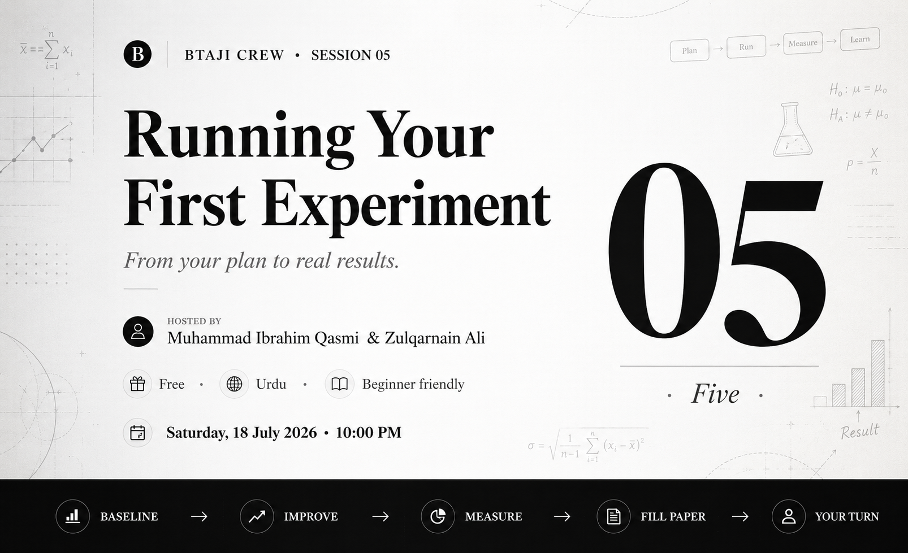

# Session 5 - Running Your First Experiment

> A practical session on turning a plan into results: build a baseline, read its failure, climb step by step, and prove each piece with an ablation.

| | |
|---|---|
| **Date** | 18 July 2026 |
| **Duration** | ~1 hour 10 minutes |
| **Language** | Urdu |
| **Hosts** | Muhammad Ibrahim Qasmi (Youngest 3x Kaggle Grandmaster) and Zulqarnain Ali (Kaggle Competition Expert) |
| **Level** | Beginner |

## Watch the recording

[Watch on YouTube](https://youtu.be/-VfKmHZJ5I0)

[Watch the full playlist](https://youtube.com/playlist?list=PLJPlXj5tLhiE&si=0679eGl6FdBYb1lH)

## Slides

[session-5-slides.pptx](session-5-slides.pptx)

## What we covered

- Build a simple baseline first, the point you compare everything against. A weak baseline is still a good baseline, because it gives you a target to beat.
- A negative or poor first result is a diagnosis, not broken code. We use the failure to spot the real problems: image distortion, tilted photos, and grid noise.
- The climb: fix the specific flaws you found, then move from basic methods to stronger ones, one honest change at a time.
- Ablation studies: turn parts of the method off to prove each one earns its place and that the whole is a real, unified system.
- Learn from the winners. Study what the top teams did and adopt their method, instead of blindly copying a state-of-the-art model.
- Researcher habits: save every output (charts, tables, data) so you never retrain by accident, smoke-test on a tiny sample before the full run, and manage your GPU on Kaggle.
- Document the pipeline in your paper, with Mermaid for the architecture diagram and LaTeX for the write-up.

## Timeline

| Time | Topic |
|---:|---|
| 0:00 | Intro and recap of Sessions 1 to 4 |
| 2:08 | Defining the baseline: a simple model to beat |
| 6:56 | ECG case study: a baseline with basic image processing |
| 12:18 | Why a weak baseline is still a good baseline |
| 14:01 | Reading the failure: distortion, tilt, and grid noise |
| 18:57 | The climb: step by step improvement |
| 20:39 | Ablation: what each part of the method contributes |
| 23:19 | Learning from the winners, not just copying them |
| 30:30 | The same workflow on a simpler example (student data) |
| 36:56 | Documenting the pipeline in your paper |
| 56:00 | Tools: Mermaid diagrams, LaTeX, and references |
| 1:02:28 | Saving outputs, smoke tests, and GPU tips on Kaggle |
| 1:06:47 | Final thoughts, and what is next |

## Tools shown

- Kaggle - https://www.kaggle.com/
- Overleaf, write LaTeX in the browser - https://www.overleaf.com/
- Mermaid, for architecture diagrams - https://mermaid.js.org/
- ECG image digitization dataset (PhysioNet 2024) - https://www.kaggle.com/competitions/physionet-ecg-image-digitization

## Worked example

The whole workflow was shown live on one example: **ECG image digitization**, turning a photo or scan of a paper ECG into a clean signal. A classical baseline fails on every kind of image damage, and a neural pipeline that rectifies the page and then reads it is robust across all of them. The same steps are shown on a simpler student-data example so the workflow is easy to copy.

## Your task

1. Run a baseline on your own topic (or the ECG example) and get one first number.
2. Read the failure: write down exactly where it breaks.
3. Save your charts and tables so you never recompute them.
4. Post your baseline number and one screenshot in the community group before the next session.

## Join the community

[WhatsApp group](https://chat.whatsapp.com/E29f5rozhAo8RbKjA00eSh)
