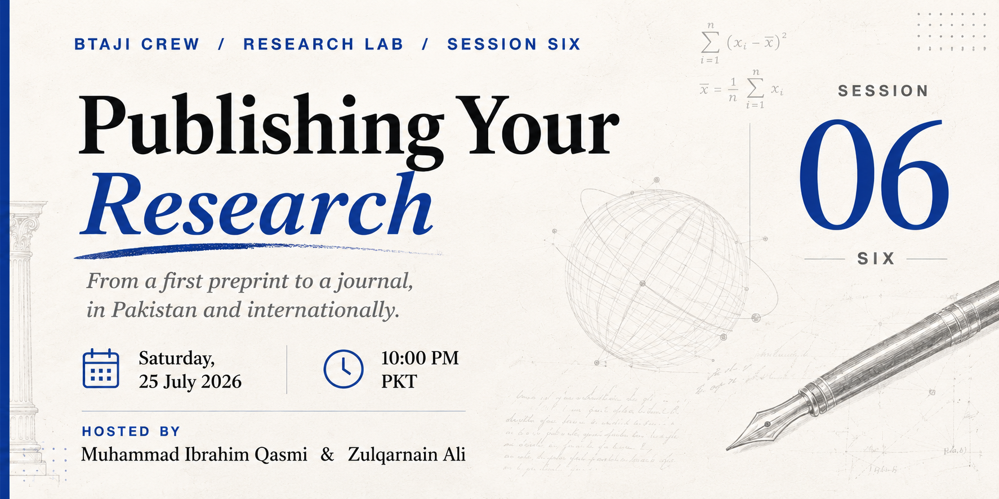

# Session 6 - Publishing Your Research

> A complete, beginner-friendly map of publishing: where your finished paper can go, how to read journal and conference quality, what it costs, how it works in Pakistan, and how to avoid getting scammed.

| | |
|---|---|
| **Date** | 26 July 2026 |
| **Duration** | ~1 hour 21 minutes |
| **Language** | Urdu |
| **Hosts** | Muhammad Ibrahim Qasmi (Youngest 3x Kaggle Grandmaster) and Zulqarnain Ali (Kaggle Competition Expert) |
| **Level** | Beginner |

## Watch the recording

[Watch on YouTube](https://youtu.be/vVOQ_LU0WZc)

[Watch the full playlist](https://youtube.com/playlist?list=PLJPlXj5tLhiE&si=0679eGl6FdBYb1lH)

## Slides

[session-6-slides.pptx](session-6-slides.pptx)

## What we covered

- **Key terms first.** The words most guides use before you understand them: manuscript, venue, peer review, proceedings, archival vs non-archival, camera-ready, indexing, DOI, ISSN, APC, quartile, and open access.
- **Five homes for your work.** A preprint, a workshop, a conference, a journal, and your thesis, and how to match the home to how finished and how urgent your work is.
- **Preprints.** Publish first, free, and timestamped. What a timestamp really shows (public disclosure), and the checks to run before you post.
- **Conferences and workshops.** Why a conference paper is a great first target, how the A\*, A, B, C tiers work (with real names like NeurIPS and CVPR), and the step everyone gets wrong: an accepted paper is only indexed when the edition has official proceedings and you finish camera-ready, registration, and presentation. Archival vs non-archival.
- **Journals.** Indexing vs metrics, kept separate. JIF, CiteScore, SJR, h-index, and quartiles in plain words, and a checklist for choosing a journal.
- **The money.** Closed, gold, hybrid, green, and diamond open access, and who actually pays. All fees are approximate examples, verify the official page.
- **Publishing in Pakistan.** The HEC W, X, Y system, and how to read a journal's current category on HJRS.
- **Choosing your route.** By your goal, not by chasing the word "international." A strong national venue can beat a weak international one.
- **Staying safe and doing it right.** Spotting predatory venues, authorship done right (first, corresponding, last, plus gift and ghost), and the submission toolkit (preprint, AAM, and version of record).
- **Your next step.** Using your paper to reach professors, an honest plan with an ECG digitization paper as the running example, and what to do this week.

## Timeline

| Time | Topic |
|---:|---|
| 0:00 | Intro and recap of Sessions 1 to 5 |
| 4:49 | Key terms before we continue |
| 12:30 | The five homes for your work |
| 15:00 | Preprints, publish first and free |
| 23:00 | Conferences and workshops, archival vs non-archival |
| 35:00 | Journals, indexing vs metrics, JIF and quartiles |
| 45:00 | The money, open access and APCs |
| 50:00 | Publishing in Pakistan, HEC W, X, Y and HJRS |
| 57:00 | Choosing your route, predatory venues, and authorship |
| 1:05:00 | The submission toolkit, and handling peer review |
| 1:14:00 | A real plan, reaching professors, and closing |

## Resources shown

- arXiv - https://arxiv.org/
- Preprints.org - https://www.preprints.org/
- DOAJ, no-fee open access journals - https://doaj.org/
- Sherpa Romeo, self-archiving policies - https://v2.sherpa.ac.uk/romeo/
- HEC HJRS, Pakistan journal categories - https://hjrs.hec.gov.pk/
- Scopus source list - https://www.scopus.com/sources
- CORE conference rankings - https://portal.core.edu.au/conf-ranks/
- Think. Check. Submit., the anti-predatory checklist - https://thinkchecksubmit.org/
- ORCID, your free author ID - https://orcid.org/

## Your task

1. Pick one route for your own paper: preprint, workshop, conference, or journal.
2. Verify it: check the venue's policy, confirm its indexing, and for Pakistan check its current HJRS category.
3. Create your ORCID at orcid.org.
4. Post your chosen route and one screenshot of your verification in the community group before the next session.

## Join the community

[WhatsApp group](https://chat.whatsapp.com/E29f5rozhAo8RbKjA00eSh)
