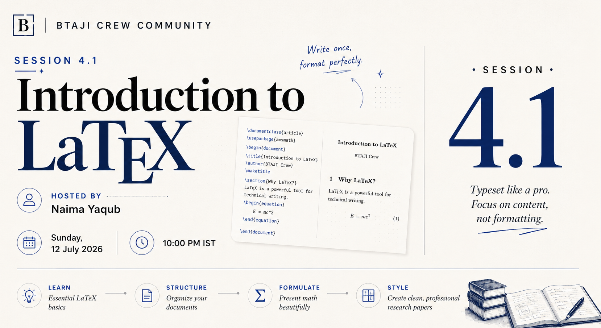

# Session 4.1 - Introduction to LaTeX

> A hands-on volunteer session on writing professional documents with LaTeX, from your first Overleaf project to tables, figures, math, and references.

| | |
|---|---|
| **Date** | 12 July 2026 |
| **Duration** | ~1 hour 9 minutes |
| **Language** | Urdu |
| **Presenter** | Naima Yaqub (BTAJI Crew community volunteer) |
| **Series hosts** | Muhammad Ibrahim Qasmi (Youngest 3x Kaggle Grandmaster) and Zulqarnain Ali (Kaggle Competition Expert) |
| **Level** | Beginner |

> This is a bonus volunteer session, taught by **Naima Yaqub**, one of our research community members who offered to share what she knows. That is exactly what the BTAJI Crew is about: we learn, we grow, and then we teach what we know. Thank you, Naima.

## Watch the recording

[Watch on YouTube](https://youtu.be/2XXJIIBPfok)

[Watch the full playlist](https://youtube.com/playlist?list=PLJPlXj5tLhiE&si=0679eGl6FdBYb1lH)

## Slides

[session-4.1-slides.pptx](session-4.1-slides.pptx)

## What we covered

LaTeX is not just for research papers. It is for your CV, your research proposal, your thesis, and your documentation. Once you learn it, everything you write looks professional.

- Why LaTeX for research, and setting up a free project on Overleaf.
- The structure of a LaTeX document: the document class, packages, and sections.
- Text formatting: bold, italics, underline, emphasis, and ordered and unordered lists.
- Tables with `tabular`, alignment and lines, then cleaner tables with the `booktabs` package.
- Inserting figures with `includegraphics`, and referencing them with `caption` and `label`.
- Mathematical typesetting: inline math, numbered and displayed equations, and the `amsmath` package for integrals, fractions, and symbols.
- References and bibliography from a `.bib` file, linked to Google Scholar entries.
- Troubleshooting the common errors: undefined control sequences, missing brackets, and broken references.

## Timeline

| Time | Topic |
|---:|---|
| 00:00 | Intro and why LaTeX for research |
| 03:36 | Getting started with Overleaf |
| 05:31 | Document structure and basics: document class, packages, sections |
| 13:38 | Text formatting: bold, italics, underline, and lists |
| 23:03 | Tables: tabular, alignment, and lines |
| 34:10 | Cleaner tables with the booktabs package |
| 36:46 | Inserting figures: includegraphics, caption, and label |
| 45:06 | Mathematical equations: inline, displayed, and amsmath |
| 58:34 | References and bibliography with a .bib file |
| 1:06:01 | Troubleshooting common LaTeX errors |

## Tools shown

- Overleaf, write LaTeX in the browser - https://www.overleaf.com/
- Overleaf documentation, learn the basics in about 30 minutes - https://www.overleaf.com/learn
- booktabs, for professional tables - https://ctan.org/pkg/booktabs
- amsmath, for mathematical typesetting - https://ctan.org/pkg/amsmath
- Google Scholar, for BibTeX citation entries - https://scholar.google.com/

## Your task

Open a free Overleaf project and rebuild one page of something you already have: a CV, a proposal, or a section of a report. Use a heading, a list, one table with `booktabs`, one figure, and one reference from a `.bib` file. Post a screenshot in the community group.

## Join the community

[WhatsApp group](https://chat.whatsapp.com/E29f5rozhAo8RbKjA00eSh)
