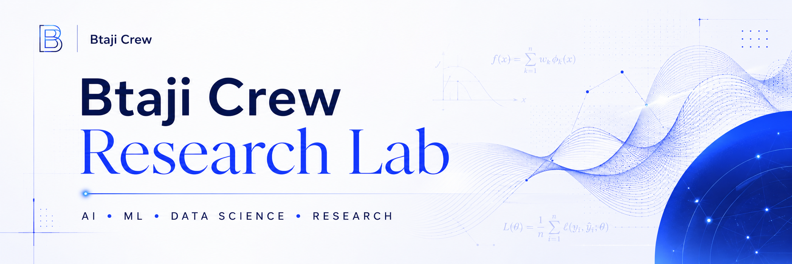

# BTAJI Crew Research Lab

**Learn how to actually do research, one session at a time.**

A free, community-led series that takes you from *"I want to do research"* to reading papers, finding gaps, and writing your first one.

[Join the Community](https://chat.whatsapp.com/E29f5rozhAo8RbKjA00eSh) • [Website](https://btaji-crew.ibrahimqasmi.com/) • [YouTube](https://youtu.be/IMJx7ECaIEk)

---

## What this is

BTAJI Crew Research Lab is an open series of live sessions on how to do real research, made for students and complete beginners. Every session is recorded, and the slides live here, free, so anyone can follow along at their own pace.

No fluff. Just the practical path: what research really is, how to read papers without drowning in them, how to find a gap, and how to write and publish your first paper.

## Sessions

| # | Session | Date | Watch | Slides | Notes |
|:-:|---------|:----:|:-----:|:------:|:-----:|
| 01 | **How to Write Your First Research Paper** | 21 Jun 2026 | [Video](https://youtu.be/IMJx7ECaIEk) | [PDF](sessions/01-first-research-paper/slides.pdf) | [Read](sessions/01-first-research-paper/) |

> More sessions are on the way. Star this repo to get notified.

## Who runs it

- **Muhammad Ibrahim Qasmi** — 3x Kaggle Grandmaster and ML researcher.
- **Zulqarnain Ali** — ML researcher and mentor, focused on making hard ideas simple.

Guest hosts join us for some sessions.

## Join us

- **Community:** [WhatsApp group](https://chat.whatsapp.com/E29f5rozhAo8RbKjA00eSh)
- **Website:** [link](https://btaji-crew.ibrahimqasmi.com/)
- **YouTube:** [channel](https://youtu.be/IMJx7ECaIEk)

If these sessions help you, share them with one friend who wants to start doing research.

---

Built with care by the <b>BTAJI Crew Community</b>.

