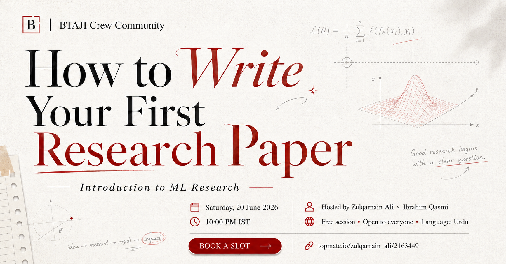

# Session 1 - What Research Is and How to Read a Paper

> An introduction to ML research: what research really is, how a researcher thinks, and how to read a paper.

| | |
|---|---|
| **Date** | 21 June 2026 |
| **Duration** | ~1 hour 48 minutes |
| **Language** | Urdu |
| **Hosts** | Muhammad Ibrahim Qasmi (Youngest 3x Kaggle Grandmaster) and Zulqarnain Ali (Kaggle Competition Expert) |
| **Level** | Beginner |

## Watch the recording

[Watch on YouTube](https://youtu.be/IMJx7ECaIEk)

[Watch the full playlist](https://youtube.com/playlist?list=PLJPlXj5tLhiE&si=0679eGl6FdBYb1lH)

## Slides

[slides.pdf](slides.pdf)

## What we covered

- What research actually is, and how it is different from a blog or a project.
- How to think like a researcher: precise, curious, and evidence-first.
- The five types of research, and which one to start with.
- How to read a paper without trying to understand every word, with two live paper reads (Attention Is All You Need, and ResNet).
- The difference between a limitation and a research gap.

## Timeline

| Time | Topic |
|---:|---|
| 00:00 | Intro and host overview |
| 02:48 | What research really is: claim, evidence, and novelty |
| 13:04 | Types of research: empirical, survey, position, case study, workshop |
| 21:38 | Why research matters: learning, building, and researching |
| 31:28 | How to read a paper |
| 31:45 | Live read: Attention Is All You Need |
| 59:27 | Limitation vs gap |
| 1:00:54 | Live read: ResNet (Deep Residual Learning) |
| 1:09:04 | Note-taking and research workflow |
| 1:10:07 | Task assignment |
| 1:12:05 | Q&A |

## Papers we read live

- Attention Is All You Need - https://arxiv.org/abs/1706.03762
- Deep Residual Learning for Image Recognition (ResNet) - https://arxiv.org/abs/1512.03385

## Your task

Pick one paper you care about and write a 5-sentence summary:
1. **Problem** - what gap does it address?
2. **Method** - what is the solution?
3. **Result** - what was the main outcome?
4. **Limitation** - what did the authors miss?
5. **Idea** - one way you would improve it.

Post it in the community group before the next session.

## Join the community

[WhatsApp group](https://chat.whatsapp.com/E29f5rozhAo8RbKjA00eSh)
