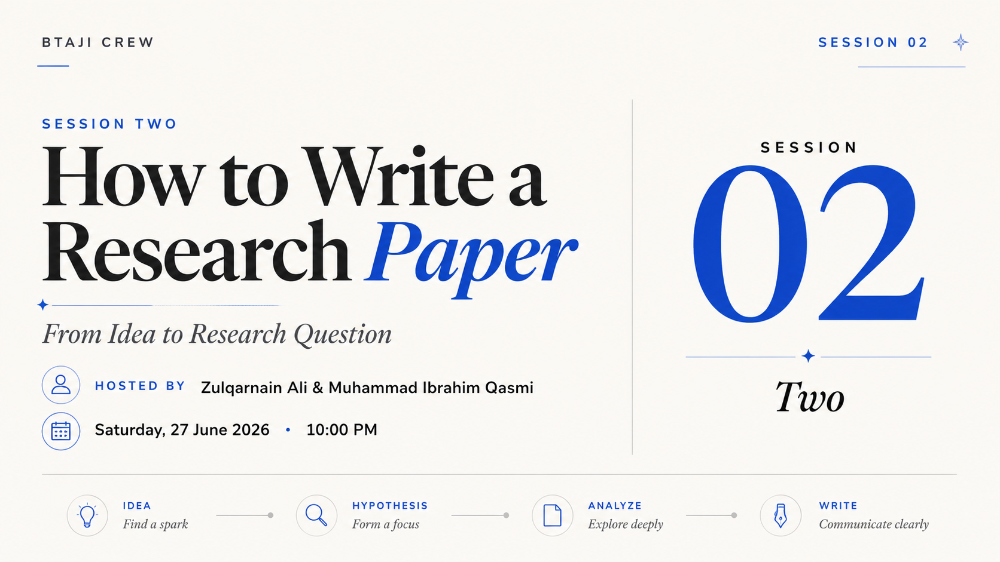

# Session 2 - Finding Your Gap, Literature Review, and Research Question

> A practical session on moving from an idea to a research question through literature review, paper analysis, and gap finding.

| | |
|---|---|
| **Date** | 27 June 2026 |
| **Duration** | ~1 hour 49 minutes |
| **Language** | Urdu |
| **Hosts** | Muhammad Ibrahim Qasmi (Youngest 3x Kaggle Grandmaster) and Zulqarnain Ali (Kaggle Competition Expert) |
| **Level** | Beginner |

## Watch the recording

[Watch on YouTube](https://www.youtube.com/watch?v=fiJni4jwVuo&list=PLJPlXj5tLhiE&index=6)

[Watch the full playlist](https://youtube.com/playlist?list=PLJPlXj5tLhiE&si=0679eGl6FdBYb1lH)

## Slides

[slides.pdf](slides.pdf)

## What we covered

- How to move from a broad idea to a testable hypothesis.
- How to search papers with targeted keywords instead of random browsing.
- How to analyze each paper using problem, contribution, and limitation.
- How limitations can become a research gap.
- How to turn a gap into a clear research question.
- A practical project walkthrough on rare cancer diagnosis using cross-domain and cross-modality transfer learning.

## Timeline

| Time | Topic |
|---:|---|
| 00:00 | Intro and recap of Session 1 |
| 13:01 | Idea formation and hypothesis |
| 14:11 | Literature review: finding papers with targeted keywords |
| 30:23 | Paper analysis: problem, contribution, limitation |
| 43:24 | Practical project walkthrough and research categories |
| 1:00:25 | Research is a loop, not a straight line |
| 1:33:06 | Proving every claim with a cited paper |
| 1:35:13 | Finding the gap: cross-dimensional transfer |
| 1:37:57 | Read real PDFs, not just AI summaries |

## Papers discussed

- Do All Languages Cost the Same? Tokenization in the Era of Commercial Language Models - https://arxiv.org/abs/2305.13707
- Language Model Tokenizers Introduce Unfairness Between Languages - https://arxiv.org/abs/2305.15425

## Practical example

Zulqarnain walked through his project: **Cross-Domain Cross-Modality Transfer Learning via Few-Shot Learning for Rare Cancer Diagnosis**.

The goal was to show how a real project can be broken into categories, supported with citations, and shaped into a research gap and research questions.

## Your task

Pick one topic you are curious about and collect 10 to 15 recent papers. For each paper, write:

1. **Problem** - what problem does the paper address?
2. **Contribution** - what did the paper add or prove?
3. **Limitation** - what is still missing?

Then choose one limitation that could become a gap, and turn it into one research question.

## Join the community

[WhatsApp group](https://chat.whatsapp.com/E29f5rozhAo8RbKjA00eSh)
